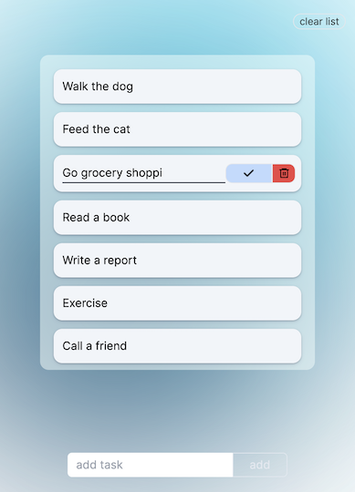

## Fancy little ToDo App

It does what its name says

## TechStack

- TS, React, Next.js
- twMerge, clsx, class-variance-authority
- Zustand
- TailwindCSS
- Framer Motion



## Reusable Components in TailwindCSS with variants

- I like how `styled-components` allows to create different variants of components and I was looking for away to do replicate this with tailwindCSS.
- `twMerge`, `clsx` and `class-variance-authority` allow to do exactly that:

  - `variant: {}` stores any new variant of the button
  - `size: {}` allows for different sizes of one variant.
  - `defaultVariant {}` applies a pre-determinded combination of variant and size in case they aren't explicitly given to the component. <br/><br/>

  ```typescript
  type ButtonProps = ButtonHTMLAttributes<HTMLButtonElement> &
    VariantProps<typeof buttonVariants> & {
      children: React.ReactNode;
    };
  export default function Button({
    children,
    variant,
    size,
    ...props
  }: ButtonProps) {
    return (
      <button className={cn(buttonVariants({ variant, size }))} {...props}>
        {children}
      </button>
    );
  }

  const buttonVariants = cva("border", {
    variants: {
      variant: {
        primary: "fixed place-items-center top-[3%] right-[3%] text-[#3b4749] ",
        secondary: "border-2 text-white border-grey",
        danger: "border-2 bg-red-500",
        addTaskDisabled: `w-[20%] max-w-[120px] py-2 border border-slate-200 rounded-r-md text-slate-200
        xs:text-xs xs:py-1`,
        addTaskEnabled: `w-[20%] py-2 border border-white rounded-r-md text-white
        xs:text-xs xs:py-1`,
      },
      size: {
        sm: "text-sm px-1 py-0",
        md: "text-base px-2 py-1",
        lg: "text-xl px-3 py-2",
      },
    },
    defaultVariants: {
      variant: "primary",
      size: "md",
    },
  });
  ```

This is how the component is used:

```typescript
{
  inputValue ? (
    <NewTaskButton
      variant="addTaskEnabled"
      onClick={handleAddTaskButton}
      disabled={!inputValue}
    >
      add
    </NewTaskButton>
  ) : (
    <NewTaskButton
      variant="addTaskDisabled"
      onClick={handleAddTaskButton}
      disabled={!inputValue}
    >
      add
    </NewTaskButton>
  );
}
```

`cn()` consists of `twMerge` and `clsx`...

```typescript
import { ClassValue, clsx } from "clsx";
import { twMerge } from "tailwind-merge";

export default function cn(...inputs: ClassValue[]) {
  return twMerge(clsx(inputs));
}
```

to make this line less cluttered:

```typescript
<button className={cn(buttonVariants({ variant, size }))} {...props}>
```
